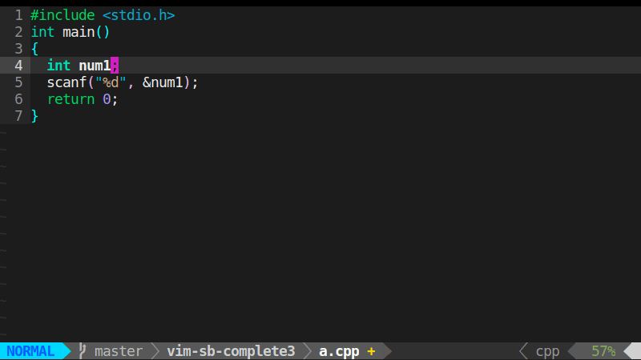

## `vim-sb-complete3`

the most lightweight(SHA BI) completion plug of vim

### Demo



- basic function


- completion in words


- fix wrong spelling


- support for words next to CJK


- can be record into reg

### Installation

- manual
    - put the `autoload/sbcom3.vim` to `~/.vim/autoload/`
    - put the `plugin/sbcom3.vim` to `~/.vim/plugin/`

- `vim-plug`
    - add `Plug 'niabie/vim-sb-complete3'` to your `~/.vimrc`
        - execute `:PlugInstall` in vim

### Usage

1. add this to `~/.vimrc`, to start-up the plug

```vim
let g:sbcom3_active = 1
```

2. manual turning off or on
    - turn off `:SbCom3Off`
    - turn on `:SbCom3On`

3. The default trigger is `<tab>`. If you want to change the trigger, for example, replace `<tab>` with `<space>`, add this to your `~/.vimrc`

```vim
let g:sbcom3_trigger = "<space>"
```

another example, using a sequence `jkl` to replace `<tab>`

```vim
let g:sbcom3_trigger = "jkl"
```

Don't use this command in commandline directly

### Uninstallation

- manual
    - delete `autoload/sbcom3.vim`
    - delete `plugin/sbcom3.vim`

- `vim-plug`
    -  ~~`Plug 'niabie/vim-sb-complete3'`~~
        - execute `:PlugClean` in vim

### New features comparing to vim-sb-complete2

1. it has the candidate columns of words
2. it can be record into the reg `.` in `cgn` mode
3. better support for special characters such as CJK
